# Sơ đồ cơ sở dữ liệu

Sinh từ cơ sở dữ liệu thật bằng `sinh_erd.py`, **không sửa tay**. 63 bảng, 189 khóa ngoại.
Mỗi nhóm vẽ đủ cột của bảng trong nhóm; bảng thuộc nhóm khác chỉ hiện tên. `PK` là khóa chính, `FK` là khóa ngoại.

## 1. Địa lý

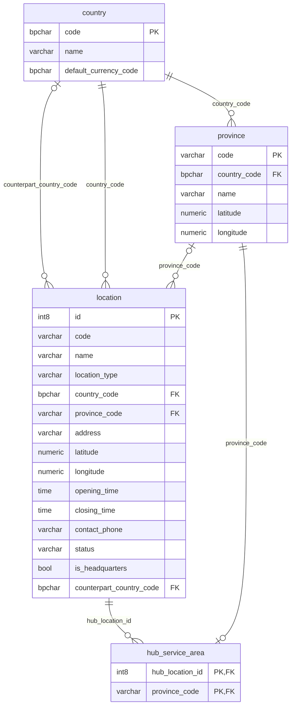
```mermaid
erDiagram
    country {
        bpchar code PK
        varchar name
        bpchar default_currency_code
    }
    province {
        varchar code PK
        bpchar country_code FK
        varchar name
        numeric latitude
        numeric longitude
    }
    location {
        int8 id PK
        varchar code
        varchar name
        varchar location_type
        bpchar country_code FK
        varchar province_code FK
        varchar address
        numeric latitude
        numeric longitude
        time opening_time
        time closing_time
        varchar contact_phone
        varchar status
        bool is_headquarters
        bpchar counterpart_country_code FK
    }
    hub_service_area {
        int8 hub_location_id PK, FK
        varchar province_code PK, FK
    }
    location ||--o{ hub_service_area : "hub_location_id"
    province ||--o| hub_service_area : "province_code"
    country |o--o{ location : "counterpart_country_code"
    country ||--o{ location : "country_code"
    province |o--o{ location : "province_code"
    country ||--o{ province : "country_code"
```

## 2. Tài khoản, các bên

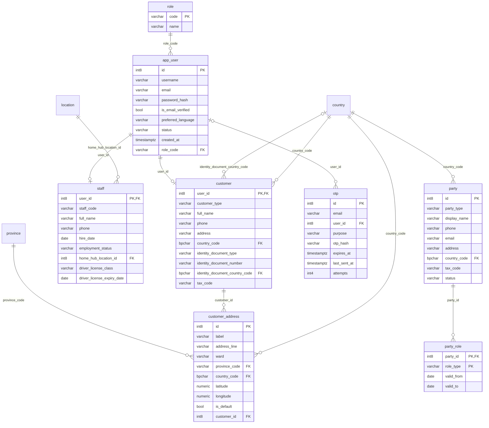
```mermaid
erDiagram
    app_user {
        int8 id PK
        varchar username
        varchar email
        varchar password_hash
        bool is_email_verified
        varchar preferred_language
        varchar status
        timestamptz created_at
        varchar role_code FK
    }
    role {
        varchar code PK
        varchar name
    }
    customer {
        int8 user_id PK, FK
        varchar customer_type
        varchar full_name
        varchar phone
        varchar address
        bpchar country_code FK
        varchar identity_document_type
        varchar identity_document_number
        bpchar identity_document_country_code FK
        varchar tax_code
    }
    customer_address {
        int8 id PK
        varchar label
        varchar address_line
        varchar ward
        varchar province_code FK
        bpchar country_code FK
        numeric latitude
        numeric longitude
        bool is_default
        int8 customer_id FK
    }
    staff {
        int8 user_id PK, FK
        varchar staff_code
        varchar full_name
        varchar phone
        date hire_date
        varchar employment_status
        int8 home_hub_location_id FK
        varchar driver_license_class
        date driver_license_expiry_date
    }
    party {
        int8 id PK
        varchar party_type
        varchar display_name
        varchar phone
        varchar email
        varchar address
        bpchar country_code FK
        varchar tax_code
        varchar status
    }
    party_role {
        int8 party_id PK, FK
        varchar role_type PK
        date valid_from
        date valid_to
    }
    otp {
        int8 id PK
        varchar email
        int8 user_id FK
        varchar purpose
        varchar otp_hash
        timestamptz expires_at
        timestamptz last_sent_at
        int4 attempts
    }
    role ||--o{ app_user : "role_code"
    country ||--o{ customer : "country_code"
    country |o--o{ customer : "identity_document_country_code"
    app_user ||--o| customer : "user_id"
    country ||--o{ customer_address : "country_code"
    customer ||--o{ customer_address : "customer_id"
    province ||--o{ customer_address : "province_code"
    app_user |o--o{ otp : "user_id"
    country ||--o{ party : "country_code"
    party ||--o{ party_role : "party_id"
    location ||--o{ staff : "home_hub_location_id"
    app_user ||--o| staff : "user_id"
```

## 3. Ngựa

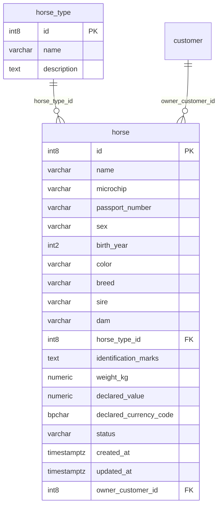
```mermaid
erDiagram
    horse_type {
        int8 id PK
        varchar name
        text description
    }
    horse {
        int8 id PK
        varchar name
        varchar microchip
        varchar passport_number
        varchar sex
        int2 birth_year
        varchar color
        varchar breed
        varchar sire
        varchar dam
        int8 horse_type_id FK
        text identification_marks
        numeric weight_kg
        numeric declared_value
        bpchar declared_currency_code
        varchar status
        timestamptz created_at
        timestamptz updated_at
        int8 owner_customer_id FK
    }
    horse_type ||--o{ horse : "horse_type_id"
    customer ||--o{ horse : "owner_customer_id"
```

## 4. Mạng lưới, lịch chạy

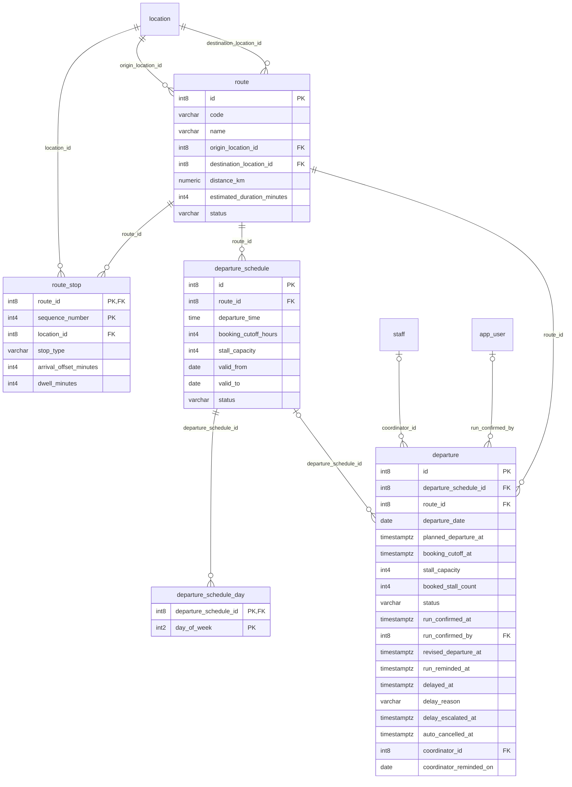
```mermaid
erDiagram
    route {
        int8 id PK
        varchar code
        varchar name
        int8 origin_location_id FK
        int8 destination_location_id FK
        numeric distance_km
        int4 estimated_duration_minutes
        varchar status
    }
    route_stop {
        int8 route_id PK, FK
        int4 sequence_number PK
        int8 location_id FK
        varchar stop_type
        int4 arrival_offset_minutes
        int4 dwell_minutes
    }
    departure_schedule {
        int8 id PK
        int8 route_id FK
        time departure_time
        int4 booking_cutoff_hours
        int4 stall_capacity
        date valid_from
        date valid_to
        varchar status
    }
    departure_schedule_day {
        int8 departure_schedule_id PK, FK
        int2 day_of_week PK
    }
    departure {
        int8 id PK
        int8 departure_schedule_id FK
        int8 route_id FK
        date departure_date
        timestamptz planned_departure_at
        timestamptz booking_cutoff_at
        int4 stall_capacity
        int4 booked_stall_count
        varchar status
        timestamptz run_confirmed_at
        int8 run_confirmed_by FK
        timestamptz revised_departure_at
        timestamptz run_reminded_at
        timestamptz delayed_at
        varchar delay_reason
        timestamptz delay_escalated_at
        timestamptz auto_cancelled_at
        int8 coordinator_id FK
        date coordinator_reminded_on
    }
    staff |o--o{ departure : "coordinator_id"
    departure_schedule |o--o{ departure : "departure_schedule_id"
    route ||--o{ departure : "route_id"
    app_user |o--o{ departure : "run_confirmed_by"
    route ||--o{ departure_schedule : "route_id"
    departure_schedule ||--o{ departure_schedule_day : "departure_schedule_id"
    location ||--o{ route : "destination_location_id"
    location ||--o{ route : "origin_location_id"
    location ||--o{ route_stop : "location_id"
    route ||--o{ route_stop : "route_id"
```

## 5. Xe

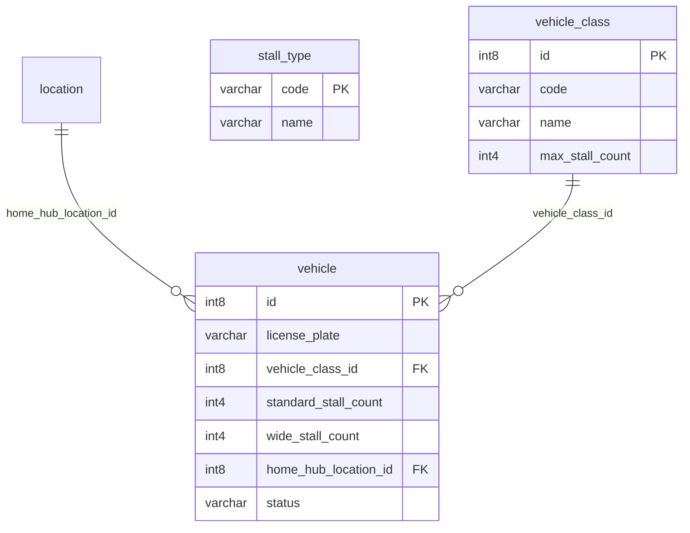
```mermaid
erDiagram
    vehicle_class {
        int8 id PK
        varchar code
        varchar name
        int4 max_stall_count
    }
    stall_type {
        varchar code PK
        varchar name
    }
    vehicle {
        int8 id PK
        varchar license_plate
        int8 vehicle_class_id FK
        int4 standard_stall_count
        int4 wide_stall_count
        int8 home_hub_location_id FK
        varchar status
    }
    location ||--o{ vehicle : "home_hub_location_id"
    vehicle_class ||--o{ vehicle : "vehicle_class_id"
```

## 6. Dịch vụ, bảng giá

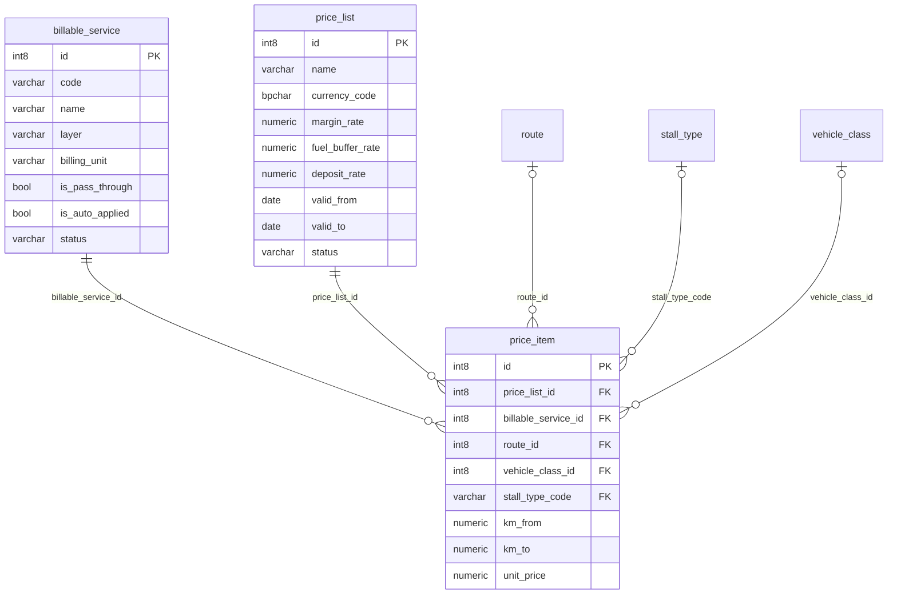
```mermaid
erDiagram
    billable_service {
        int8 id PK
        varchar code
        varchar name
        varchar layer
        varchar billing_unit
        bool is_pass_through
        bool is_auto_applied
        varchar status
    }
    price_list {
        int8 id PK
        varchar name
        bpchar currency_code
        numeric margin_rate
        numeric fuel_buffer_rate
        numeric deposit_rate
        date valid_from
        date valid_to
        varchar status
    }
    price_item {
        int8 id PK
        int8 price_list_id FK
        int8 billable_service_id FK
        int8 route_id FK
        int8 vehicle_class_id FK
        varchar stall_type_code FK
        numeric km_from
        numeric km_to
        numeric unit_price
    }
    billable_service ||--o{ price_item : "billable_service_id"
    price_list ||--o{ price_item : "price_list_id"
    route |o--o{ price_item : "route_id"
    stall_type |o--o{ price_item : "stall_type_code"
    vehicle_class |o--o{ price_item : "vehicle_class_id"
```

## 7. Quy định, giấy tờ yêu cầu

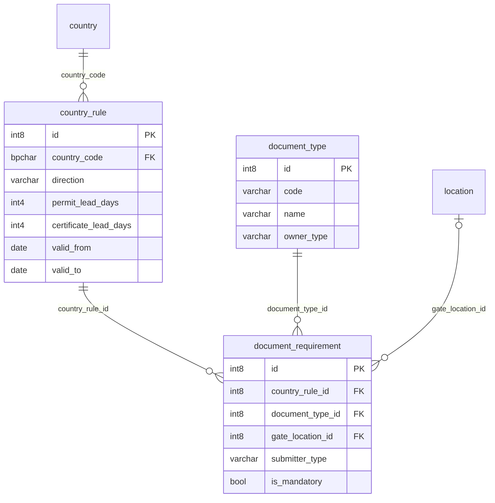
```mermaid
erDiagram
    country_rule {
        int8 id PK
        bpchar country_code FK
        varchar direction
        int4 permit_lead_days
        int4 certificate_lead_days
        date valid_from
        date valid_to
    }
    document_type {
        int8 id PK
        varchar code
        varchar name
        varchar owner_type
    }
    document_requirement {
        int8 id PK
        int8 country_rule_id FK
        int8 document_type_id FK
        int8 gate_location_id FK
        varchar submitter_type
        bool is_mandatory
    }
    country ||--o{ country_rule : "country_code"
    country_rule ||--o{ document_requirement : "country_rule_id"
    document_type ||--o{ document_requirement : "document_type_id"
    location |o--o{ document_requirement : "gate_location_id"
```

## 8. Đơn hàng

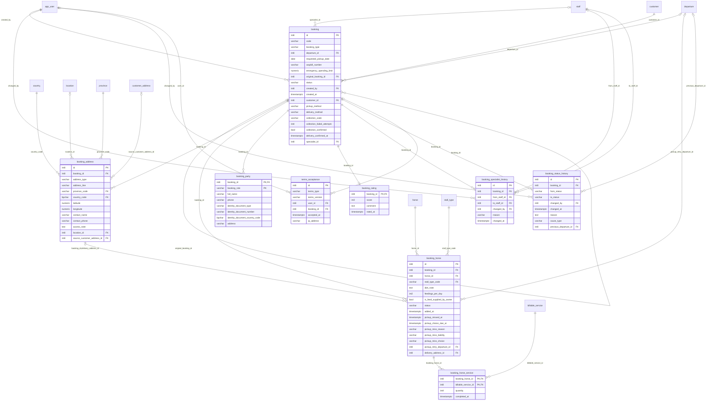
```mermaid
erDiagram
    booking {
        int8 id PK
        varchar code
        varchar booking_type
        int8 departure_id FK
        date requested_pickup_date
        varchar waybill_number
        numeric emergency_spending_limit
        int8 original_booking_id FK
        varchar status
        int8 created_by FK
        timestamptz created_at
        int8 customer_id FK
        varchar pickup_method
        varchar delivery_method
        varchar collection_code
        int4 collection_failed_attempts
        bool collection_confirmed
        timestamptz delivery_confirmed_at
        int8 specialist_id FK
    }
    booking_party {
        int8 booking_id PK, FK
        varchar booking_role PK
        varchar full_name
        varchar phone
        varchar identity_document_type
        varchar identity_document_number
        bpchar identity_document_country_code
        varchar address
    }
    booking_address {
        int8 id PK
        int8 booking_id FK
        varchar address_type
        varchar address_line
        varchar province_code FK
        bpchar country_code FK
        numeric latitude
        numeric longitude
        varchar contact_name
        varchar contact_phone
        text access_note
        int8 location_id FK
        int8 source_customer_address_id FK
    }
    booking_horse {
        int8 id PK
        int8 booking_id FK
        int8 horse_id FK
        varchar stall_type_code FK
        text diet_note
        int2 feedings_per_day
        bool is_feed_supplied_by_owner
        varchar status
        timestamptz added_at
        timestamptz pickup_missed_at
        timestamptz pickup_choice_due_at
        varchar pickup_miss_reason
        varchar pickup_miss_liability
        varchar pickup_miss_choice
        int8 pickup_retry_departure_id FK
        int8 delivery_address_id FK
    }
    booking_horse_service {
        int8 booking_horse_id PK, FK
        int8 billable_service_id PK, FK
        int4 quantity
        timestamptz completed_at
    }
    booking_status_history {
        int8 id PK
        int8 booking_id FK
        varchar from_status
        varchar to_status
        int8 changed_by FK
        timestamptz changed_at
        text reason
        varchar cause_type
        int8 previous_departure_id FK
    }
    booking_specialist_history {
        int8 id PK
        int8 booking_id FK
        int8 from_staff_id FK
        int8 to_staff_id FK
        int8 changed_by FK
        varchar reason
        timestamptz changed_at
    }
    terms_acceptance {
        int8 id PK
        varchar terms_type
        varchar terms_version
        int8 user_id FK
        int8 booking_id FK
        timestamptz accepted_at
        varchar ip_address
    }
    booking_rating {
        int8 booking_id PK, FK
        int2 score
        text comment
        timestamptz rated_at
    }
    app_user ||--o{ booking : "created_by"
    customer ||--o{ booking : "customer_id"
    departure |o--o{ booking : "departure_id"
    booking |o--o{ booking : "original_booking_id"
    staff |o--o{ booking : "specialist_id"
    booking ||--o{ booking_address : "booking_id"
    country ||--o{ booking_address : "country_code"
    location |o--o{ booking_address : "location_id"
    province ||--o{ booking_address : "province_code"
    customer_address |o--o{ booking_address : "source_customer_address_id"
    booking ||--o{ booking_horse : "booking_id"
    booking_address |o--o{ booking_horse : "booking_id,delivery_address_id"
    horse ||--o{ booking_horse : "horse_id"
    departure |o--o{ booking_horse : "pickup_retry_departure_id"
    stall_type ||--o{ booking_horse : "stall_type_code"
    billable_service ||--o{ booking_horse_service : "billable_service_id"
    booking_horse ||--o{ booking_horse_service : "booking_horse_id"
    booking ||--o{ booking_party : "booking_id"
    booking ||--o| booking_rating : "booking_id"
    booking ||--o{ booking_specialist_history : "booking_id"
    app_user ||--o{ booking_specialist_history : "changed_by"
    staff |o--o{ booking_specialist_history : "from_staff_id"
    staff ||--o{ booking_specialist_history : "to_staff_id"
    booking ||--o{ booking_status_history : "booking_id"
    app_user |o--o{ booking_status_history : "changed_by"
    departure |o--o{ booking_status_history : "previous_departure_id"
    booking |o--o{ terms_acceptance : "booking_id"
    app_user ||--o{ terms_acceptance : "user_id"
```

## 9. Vận hành

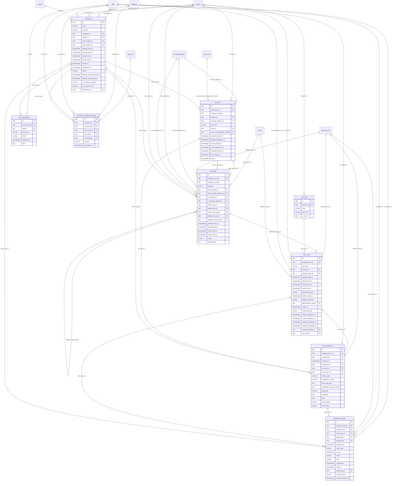
```mermaid
erDiagram
    vehicle_trip {
        int8 id PK
        varchar code
        varchar trip_type
        int8 departure_id FK
        int8 vehicle_id FK
        int8 start_location_id FK
        int8 end_location_id FK
        timestamptz planned_start_at
        timestamptz planned_end_at
        timestamptz actual_start_at
        timestamptz actual_end_at
        timestamptz sealed_at
        timestamptz disinfected_at
        varchar status
        timestamptz delivery_window_warned_at
        timestamptz delivery_ride_warned_at
        varchar end_vehicle_condition
        varchar end_vehicle_note
        int8 coordinator_id FK
    }
    trip_stop {
        int8 id PK
        int8 vehicle_trip_id FK
        int4 sequence_number
        int8 location_id FK
        int8 booking_address_id FK
        varchar stop_type
        int8 route_id FK
        int4 route_stop_sequence_number FK
        timestamptz planned_arrival_at
        timestamptz planned_departure_at
        timestamptz actual_arrival_at
        timestamptz actual_departure_at
        timestamptz expected_arrival_at
        timestamptz told_arrival_at
        timestamptz told_at
    }
    crew_assignment {
        int8 id PK
        int8 vehicle_trip_id FK
        int8 staff_id FK
        varchar crew_role
        varchar status
        timestamptz assigned_at
        text note
    }
    horse_leg {
        int8 id PK
        int8 booking_horse_id FK
        int4 sequence_number
        varchar leg_type
        int8 from_location_id FK
        int8 from_booking_address_id FK
        int8 to_location_id FK
        int8 to_booking_address_id FK
        int8 vehicle_trip_id FK
        int8 agent_party_id FK
        int8 board_trip_stop_id FK
        int8 alight_trip_stop_id FK
        int8 replaced_horse_leg_id FK
        timestamptz planned_start_at
        timestamptz planned_end_at
        timestamptz actual_start_at
        timestamptz actual_end_at
        varchar status
        int2 stall_position
    }
    horse_stay {
        int8 id PK
        int8 booking_horse_id FK
        varchar stay_type
        int8 location_id FK
        int8 operator_party_id FK
        timestamptz planned_start_at
        timestamptz planned_end_at
        timestamptz actual_start_at
        timestamptz actual_end_at
        varchar quarantine_result
        timestamptz balance_hold_at
        numeric stabling_unit_price
        int8 failed_delivery_leg_id FK
        timestamptz ready_at
        varchar ready_call_note
        timestamptz earliest_redelivery_at
        timestamptz chosen_redelivery_at
        timestamptz collection_reported_at
        timestamptz collection_expected_at
        int8 missed_departure_id FK
        int8 hub_stall_id FK
    }
    horse_health_log {
        int8 id PK
        int8 booking_horse_id FK
        int8 recorded_by FK
        timestamptz recorded_at
        int8 vehicle_trip_id FK
        int8 trip_stop_id FK
        int8 horse_stay_id FK
        varchar health_status
        numeric temperature_celsius
        int2 heart_rate_bpm
        int2 respiration_rate_per_minute
        numeric weight_kg
        text symptoms
        text note
        varchar water_intake
        varchar feed_intake
    }
    hub_stall {
        int8 id PK
        int8 location_id FK
        varchar code
        varchar stall_kind
        bool is_active
    }
    health_check_task {
        int8 id PK
        int8 booking_horse_id FK
        int8 vehicle_trip_id FK
        int8 horse_stay_id FK
        int8 assigned_to FK
        int8 assigned_by FK
        timestamptz assigned_at
        varchar check_type
        timestamptz due_at
        varchar status
        varchar note
        timestamptz accepted_at
        timestamptz done_at
        int8 health_log_id FK
        varchar cancel_reason
        timestamptz overdue_notified_at
    }
    coordinator_assignment_history {
        int8 id PK
        int8 departure_id FK
        int8 vehicle_trip_id FK
        int8 from_staff_id FK
        int8 to_staff_id FK
        int8 changed_by FK
        varchar reason
        timestamptz changed_at
    }
    app_user ||--o{ coordinator_assignment_history : "changed_by"
    departure |o--o{ coordinator_assignment_history : "departure_id"
    staff |o--o{ coordinator_assignment_history : "from_staff_id"
    staff ||--o{ coordinator_assignment_history : "to_staff_id"
    vehicle_trip |o--o{ coordinator_assignment_history : "vehicle_trip_id"
    staff ||--o{ crew_assignment : "staff_id"
    vehicle_trip ||--o{ crew_assignment : "vehicle_trip_id"
    staff ||--o{ health_check_task : "assigned_by"
    staff ||--o{ health_check_task : "assigned_to"
    booking_horse ||--o{ health_check_task : "booking_horse_id"
    horse_health_log |o--o{ health_check_task : "health_log_id"
    horse_stay |o--o{ health_check_task : "horse_stay_id"
    vehicle_trip |o--o{ health_check_task : "vehicle_trip_id"
    booking_horse ||--o{ horse_health_log : "booking_horse_id"
    horse_stay |o--o{ horse_health_log : "horse_stay_id"
    staff ||--o{ horse_health_log : "recorded_by"
    trip_stop |o--o{ horse_health_log : "trip_stop_id"
    vehicle_trip |o--o{ horse_health_log : "vehicle_trip_id"
    party |o--o{ horse_leg : "agent_party_id"
    trip_stop |o--o{ horse_leg : "alight_trip_stop_id"
    trip_stop |o--o{ horse_leg : "board_trip_stop_id"
    booking_horse ||--o{ horse_leg : "booking_horse_id"
    booking_address |o--o{ horse_leg : "from_booking_address_id"
    location |o--o{ horse_leg : "from_location_id"
    horse_leg |o--o{ horse_leg : "replaced_horse_leg_id"
    booking_address |o--o{ horse_leg : "to_booking_address_id"
    location |o--o{ horse_leg : "to_location_id"
    vehicle_trip |o--o{ horse_leg : "vehicle_trip_id"
    booking_horse ||--o{ horse_stay : "booking_horse_id"
    horse_leg |o--o{ horse_stay : "failed_delivery_leg_id"
    hub_stall |o--o{ horse_stay : "hub_stall_id"
    location ||--o{ horse_stay : "location_id"
    departure |o--o{ horse_stay : "missed_departure_id"
    party |o--o{ horse_stay : "operator_party_id"
    location ||--o{ hub_stall : "location_id"
    booking_address |o--o{ trip_stop : "booking_address_id"
    location |o--o{ trip_stop : "location_id"
    route_stop |o--o{ trip_stop : "route_id,route_stop_sequence_number"
    vehicle_trip ||--o{ trip_stop : "vehicle_trip_id"
    staff |o--o{ vehicle_trip : "coordinator_id"
    departure |o--o{ vehicle_trip : "departure_id"
    location ||--o{ vehicle_trip : "end_location_id"
    location ||--o{ vehicle_trip : "start_location_id"
    vehicle ||--o{ vehicle_trip : "vehicle_id"
```

## 10. Giao nhận

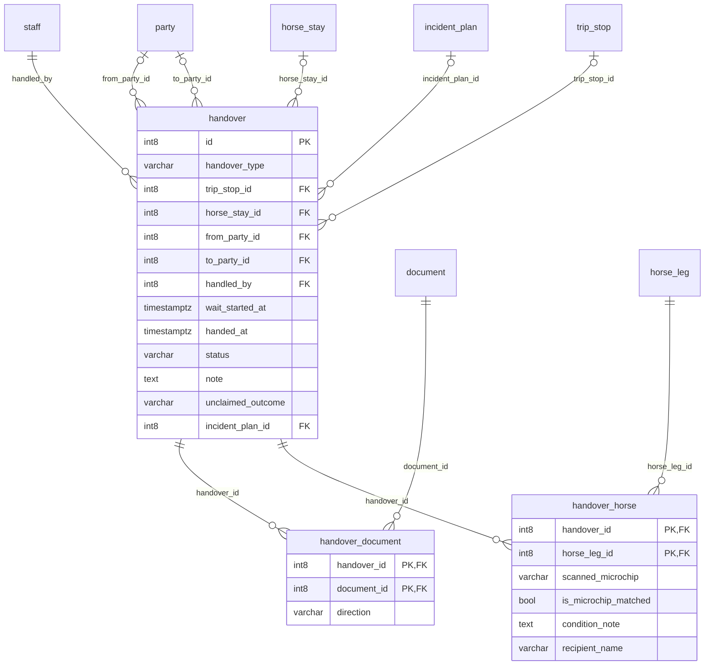
```mermaid
erDiagram
    handover {
        int8 id PK
        varchar handover_type
        int8 trip_stop_id FK
        int8 horse_stay_id FK
        int8 from_party_id FK
        int8 to_party_id FK
        int8 handled_by FK
        timestamptz wait_started_at
        timestamptz handed_at
        varchar status
        text note
        varchar unclaimed_outcome
        int8 incident_plan_id FK
    }
    handover_horse {
        int8 handover_id PK, FK
        int8 horse_leg_id PK, FK
        varchar scanned_microchip
        bool is_microchip_matched
        text condition_note
        varchar recipient_name
    }
    handover_document {
        int8 handover_id PK, FK
        int8 document_id PK, FK
        varchar direction
    }
    party |o--o{ handover : "from_party_id"
    staff ||--o{ handover : "handled_by"
    horse_stay |o--o{ handover : "horse_stay_id"
    incident_plan |o--o{ handover : "incident_plan_id"
    party |o--o{ handover : "to_party_id"
    trip_stop |o--o{ handover : "trip_stop_id"
    document ||--o{ handover_document : "document_id"
    handover ||--o{ handover_document : "handover_id"
    handover ||--o{ handover_horse : "handover_id"
    horse_leg ||--o{ handover_horse : "horse_leg_id"
```

## 11. Bảo hiểm

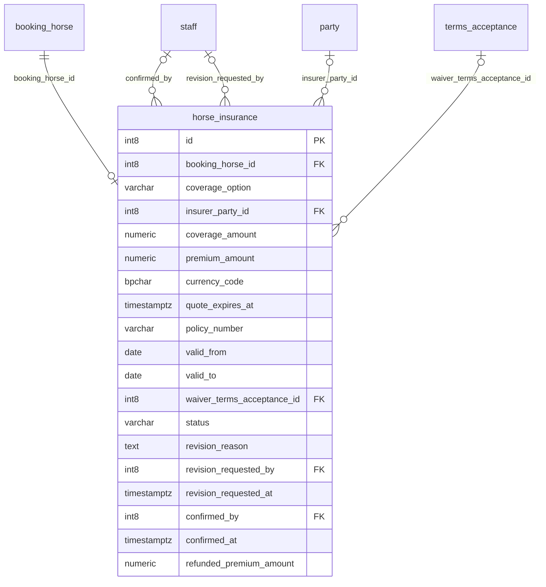
```mermaid
erDiagram
    horse_insurance {
        int8 id PK
        int8 booking_horse_id FK
        varchar coverage_option
        int8 insurer_party_id FK
        numeric coverage_amount
        numeric premium_amount
        bpchar currency_code
        timestamptz quote_expires_at
        varchar policy_number
        date valid_from
        date valid_to
        int8 waiver_terms_acceptance_id FK
        varchar status
        text revision_reason
        int8 revision_requested_by FK
        timestamptz revision_requested_at
        int8 confirmed_by FK
        timestamptz confirmed_at
        numeric refunded_premium_amount
    }
    booking_horse ||--o| horse_insurance : "booking_horse_id"
    staff |o--o{ horse_insurance : "confirmed_by"
    party |o--o{ horse_insurance : "insurer_party_id"
    staff |o--o{ horse_insurance : "revision_requested_by"
    terms_acceptance |o--o{ horse_insurance : "waiver_terms_acceptance_id"
```

## 12. Báo giá, thanh toán

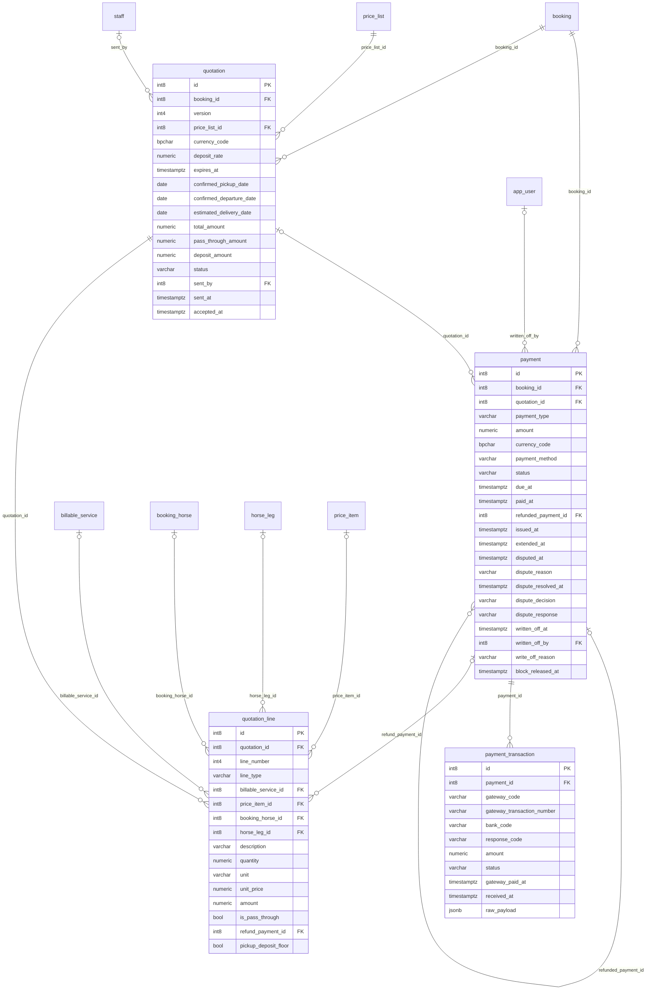
```mermaid
erDiagram
    quotation {
        int8 id PK
        int8 booking_id FK
        int4 version
        int8 price_list_id FK
        bpchar currency_code
        numeric deposit_rate
        timestamptz expires_at
        date confirmed_pickup_date
        date confirmed_departure_date
        date estimated_delivery_date
        numeric total_amount
        numeric pass_through_amount
        numeric deposit_amount
        varchar status
        int8 sent_by FK
        timestamptz sent_at
        timestamptz accepted_at
    }
    quotation_line {
        int8 id PK
        int8 quotation_id FK
        int4 line_number
        varchar line_type
        int8 billable_service_id FK
        int8 price_item_id FK
        int8 booking_horse_id FK
        int8 horse_leg_id FK
        varchar description
        numeric quantity
        varchar unit
        numeric unit_price
        numeric amount
        bool is_pass_through
        int8 refund_payment_id FK
        bool pickup_deposit_floor
    }
    payment {
        int8 id PK
        int8 booking_id FK
        int8 quotation_id FK
        varchar payment_type
        numeric amount
        bpchar currency_code
        varchar payment_method
        varchar status
        timestamptz due_at
        timestamptz paid_at
        int8 refunded_payment_id FK
        timestamptz issued_at
        timestamptz extended_at
        timestamptz disputed_at
        varchar dispute_reason
        timestamptz dispute_resolved_at
        varchar dispute_decision
        varchar dispute_response
        timestamptz written_off_at
        int8 written_off_by FK
        varchar write_off_reason
        timestamptz block_released_at
    }
    payment_transaction {
        int8 id PK
        int8 payment_id FK
        varchar gateway_code
        varchar gateway_transaction_number
        varchar bank_code
        varchar response_code
        numeric amount
        varchar status
        timestamptz gateway_paid_at
        timestamptz received_at
        jsonb raw_payload
    }
    booking ||--o{ payment : "booking_id"
    quotation |o--o{ payment : "quotation_id"
    payment |o--o{ payment : "refunded_payment_id"
    app_user |o--o{ payment : "written_off_by"
    payment ||--o{ payment_transaction : "payment_id"
    booking ||--o{ quotation : "booking_id"
    price_list ||--o{ quotation : "price_list_id"
    staff |o--o{ quotation : "sent_by"
    billable_service |o--o{ quotation_line : "billable_service_id"
    booking_horse |o--o{ quotation_line : "booking_horse_id"
    horse_leg |o--o{ quotation_line : "horse_leg_id"
    price_item |o--o{ quotation_line : "price_item_id"
    quotation ||--o{ quotation_line : "quotation_id"
    payment |o--o{ quotation_line : "refund_payment_id"
```

## 13. Sự cố, chi phí

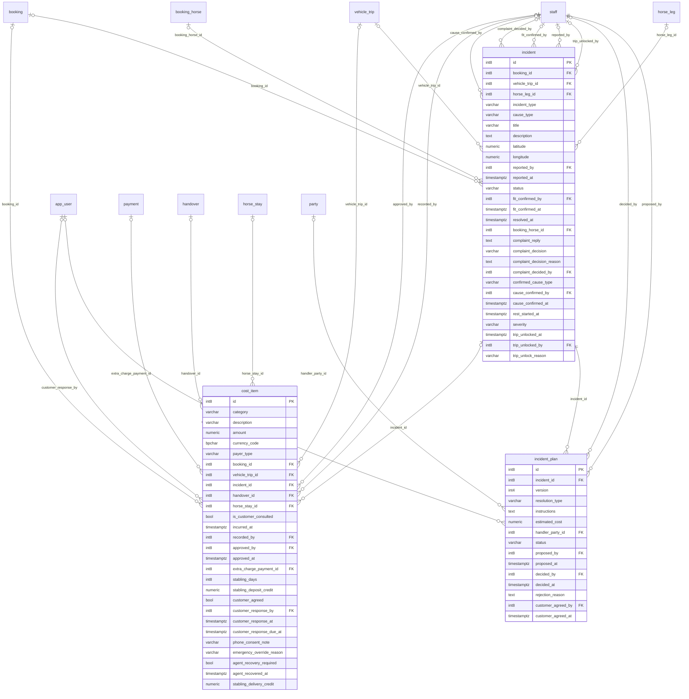
```mermaid
erDiagram
    incident {
        int8 id PK
        int8 booking_id FK
        int8 vehicle_trip_id FK
        int8 horse_leg_id FK
        varchar incident_type
        varchar cause_type
        varchar title
        text description
        numeric latitude
        numeric longitude
        int8 reported_by FK
        timestamptz reported_at
        varchar status
        int8 fit_confirmed_by FK
        timestamptz fit_confirmed_at
        timestamptz resolved_at
        int8 booking_horse_id FK
        text complaint_reply
        varchar complaint_decision
        text complaint_decision_reason
        int8 complaint_decided_by FK
        varchar confirmed_cause_type
        int8 cause_confirmed_by FK
        timestamptz cause_confirmed_at
        timestamptz rest_started_at
        varchar severity
        timestamptz trip_unlocked_at
        int8 trip_unlocked_by FK
        varchar trip_unlock_reason
    }
    incident_plan {
        int8 id PK
        int8 incident_id FK
        int4 version
        varchar resolution_type
        text instructions
        numeric estimated_cost
        int8 handler_party_id FK
        varchar status
        int8 proposed_by FK
        timestamptz proposed_at
        int8 decided_by FK
        timestamptz decided_at
        text rejection_reason
        int8 customer_agreed_by FK
        timestamptz customer_agreed_at
    }
    cost_item {
        int8 id PK
        varchar category
        varchar description
        numeric amount
        bpchar currency_code
        varchar payer_type
        int8 booking_id FK
        int8 vehicle_trip_id FK
        int8 incident_id FK
        int8 handover_id FK
        int8 horse_stay_id FK
        bool is_customer_consulted
        timestamptz incurred_at
        int8 recorded_by FK
        int8 approved_by FK
        timestamptz approved_at
        int8 extra_charge_payment_id FK
        int8 stabling_days
        numeric stabling_deposit_credit
        bool customer_agreed
        int8 customer_response_by FK
        timestamptz customer_response_at
        timestamptz customer_response_due_at
        varchar phone_consent_note
        varchar emergency_override_reason
        bool agent_recovery_required
        timestamptz agent_recovered_at
        numeric stabling_delivery_credit
    }
    staff |o--o{ cost_item : "approved_by"
    booking |o--o{ cost_item : "booking_id"
    app_user |o--o{ cost_item : "customer_response_by"
    payment |o--o{ cost_item : "extra_charge_payment_id"
    handover |o--o{ cost_item : "handover_id"
    horse_stay |o--o{ cost_item : "horse_stay_id"
    incident |o--o{ cost_item : "incident_id"
    staff |o--o{ cost_item : "recorded_by"
    vehicle_trip |o--o{ cost_item : "vehicle_trip_id"
    booking_horse |o--o{ incident : "booking_horse_id"
    booking |o--o{ incident : "booking_id"
    staff |o--o{ incident : "cause_confirmed_by"
    staff |o--o{ incident : "complaint_decided_by"
    staff |o--o{ incident : "fit_confirmed_by"
    horse_leg |o--o{ incident : "horse_leg_id"
    staff |o--o{ incident : "reported_by"
    staff |o--o{ incident : "trip_unlocked_by"
    vehicle_trip |o--o{ incident : "vehicle_trip_id"
    app_user |o--o{ incident_plan : "customer_agreed_by"
    staff |o--o{ incident_plan : "decided_by"
    party |o--o{ incident_plan : "handler_party_id"
    incident ||--o{ incident_plan : "incident_id"
    staff ||--o{ incident_plan : "proposed_by"
```

## 14. Chứng từ

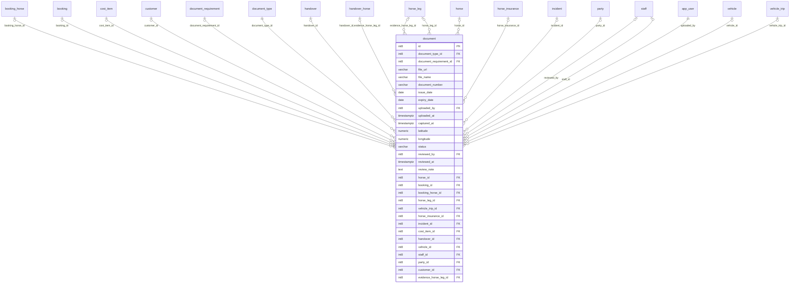
```mermaid
erDiagram
    document {
        int8 id PK
        int8 document_type_id FK
        int8 document_requirement_id FK
        varchar file_url
        varchar file_name
        varchar document_number
        date issue_date
        date expiry_date
        int8 uploaded_by FK
        timestamptz uploaded_at
        timestamptz captured_at
        numeric latitude
        numeric longitude
        varchar status
        int8 reviewed_by FK
        timestamptz reviewed_at
        text review_note
        int8 horse_id FK
        int8 booking_id FK
        int8 booking_horse_id FK
        int8 horse_leg_id FK
        int8 vehicle_trip_id FK
        int8 horse_insurance_id FK
        int8 incident_id FK
        int8 cost_item_id FK
        int8 handover_id FK
        int8 vehicle_id FK
        int8 staff_id FK
        int8 party_id FK
        int8 customer_id FK
        int8 evidence_horse_leg_id FK
    }
    booking_horse |o--o{ document : "booking_horse_id"
    booking |o--o{ document : "booking_id"
    cost_item |o--o{ document : "cost_item_id"
    customer |o--o{ document : "customer_id"
    document_requirement |o--o{ document : "document_requirement_id"
    document_type ||--o{ document : "document_type_id"
    horse_leg |o--o{ document : "evidence_horse_leg_id"
    handover |o--o{ document : "handover_id"
    handover_horse |o--o{ document : "handover_id,evidence_horse_leg_id"
    horse |o--o{ document : "horse_id"
    horse_insurance |o--o{ document : "horse_insurance_id"
    horse_leg |o--o{ document : "horse_leg_id"
    incident |o--o{ document : "incident_id"
    party |o--o{ document : "party_id"
    staff |o--o{ document : "reviewed_by"
    staff |o--o{ document : "staff_id"
    app_user ||--o{ document : "uploaded_by"
    vehicle |o--o{ document : "vehicle_id"
    vehicle_trip |o--o{ document : "vehicle_trip_id"
```

## 15. Hỗ trợ

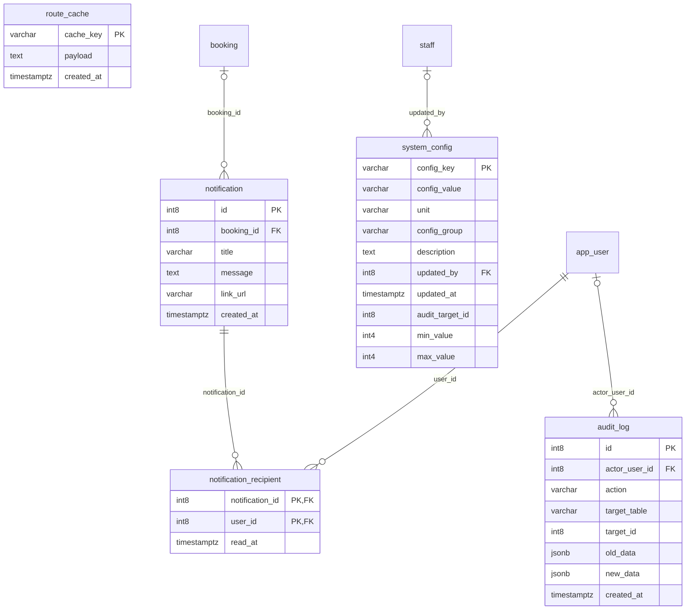
```mermaid
erDiagram
    notification {
        int8 id PK
        int8 booking_id FK
        varchar title
        text message
        varchar link_url
        timestamptz created_at
    }
    notification_recipient {
        int8 notification_id PK, FK
        int8 user_id PK, FK
        timestamptz read_at
    }
    audit_log {
        int8 id PK
        int8 actor_user_id FK
        varchar action
        varchar target_table
        int8 target_id
        jsonb old_data
        jsonb new_data
        timestamptz created_at
    }
    system_config {
        varchar config_key PK
        varchar config_value
        varchar unit
        varchar config_group
        text description
        int8 updated_by FK
        timestamptz updated_at
        int8 audit_target_id
        int4 min_value
        int4 max_value
    }
    route_cache {
        varchar cache_key PK
        text payload
        timestamptz created_at
    }
    app_user |o--o{ audit_log : "actor_user_id"
    booking |o--o{ notification : "booking_id"
    notification ||--o{ notification_recipient : "notification_id"
    app_user ||--o{ notification_recipient : "user_id"
    staff |o--o{ system_config : "updated_by"
```
